# go-matrix-bot

Go library for building [Matrix](https://matrix.org/) bots with end-to-end encryption support, built on top of [mautrix-go](https://github.com/mautrix/go).

Integrates with [go-ollama](https://github.com/eSlider/go-ollama), [go-onlyoffice](https://github.com/eSlider/go-onlyoffice), and [go-gitea-helpers](https://github.com/eSlider/go-gitea-helpers) for AI-powered project management in chat.

## Architecture


## Integration Patterns

### Pattern 1 — Echo / Utility Bot

Simple request-response with no external services.


### Pattern 2 — AI Assistant (Ollama)

User asks a question, bot streams the answer from an LLM.

```mermaid
sequenceDiagram
    participant User
    participant Matrix
    participant Bot
    participant Ollama

    User->>Matrix: ::explain Go channels
    Matrix->>Bot: event
    Bot->>Ollama: POST /api/generate
    Ollama-->>Bot: streaming tokens...
    Bot->>Bot: join tokens → markdown → HTML
    Bot->>Matrix: formatted reply @User
    Matrix->>User: rich AI response
```



### Pattern 3 — Gitea Issue Tracker

Query repositories and issues from chat.


### Pattern 4 — OnlyOffice Project Management

Manage projects and tasks from chat.


### Pattern 5 — AI + Gitea (Smart Summarizer)

Combines Gitea data with AI analysis.


### Pattern 6 — Full Integration (All Services)

The complete project management flow.


---

## Installation

```bash
go get github.com/eslider/go-matrix-bot
```

Optional integrations:

```bash
go get github.com/eslider/go-ollama           # AI responses
go get github.com/eslider/go-onlyoffice        # Project management
go get github.com/eslider/go-gitea-helpers      # Git issue tracking
```

**System dependency** (required for encryption):

```bash
# Debian/Ubuntu
sudo apt-get install libolm-dev
```

---

## Running the AI Backend

The bot's AI features (`!ai`, `!summarize`, `!review`) require an Ollama-compatible API. You can run Ollama anywhere the bot can reach it over HTTP.

**Standard setup (NVIDIA / CPU):**

```bash
docker run -d -p 11434:11434 -v ollama-data:/root/.ollama ollama/ollama
ollama pull llama3.2:3b
```

**Intel GPU acceleration (Arc / integrated):**

If your server has an Intel GPU (Arc A770, Core Ultra iGPU, Data Center Flex/Max), you can get up to **2x faster inference** compared to Vulkan by using a [SYCL-accelerated Ollama build](https://github.com/eSlider/ollama-intel-gpu):

```bash
git clone https://github.com/eSlider/ollama-intel-gpu
cd ollama-intel-gpu
docker compose up
```

This builds Ollama with Intel oneAPI SYCL backend and bundles Open WebUI at `http://localhost:3000`. The bot connects to the same `http://localhost:11434` endpoint — no code changes needed.

**Then point the bot at it:**

```bash
export OPEN_WEB_API_GENERATE_URL="http://localhost:11434/api/generate"
export OPEN_WEB_API_TOKEN=""  # local Ollama needs no token
```


---

## Quick Start

### 1. Echo Bot

```go
bot, _ := matrix.NewBot(matrix.GetEnvironmentConfig())

bot.OnMessage(func(ctx context.Context, roomID id.RoomID, sender id.UserID, msg *event.MessageEventContent) {
    bot.SendText(ctx, roomID, "Echo: "+msg.Body)
})

ctx, cancel := signal.NotifyContext(context.Background(), os.Interrupt)
defer cancel()
go bot.Run(ctx)
<-ctx.Done()
bot.Stop()
```

### 2. AI Assistant

```go
ai := ollama.NewOpenWebUiClient(&ollama.DSN{
    URL:   os.Getenv("OPEN_WEB_API_GENERATE_URL"),
    Token: os.Getenv("OPEN_WEB_API_TOKEN"),
})

bot.OnMessage(func(ctx context.Context, roomID id.RoomID, sender id.UserID, msg *event.MessageEventContent) {
    if !strings.HasPrefix(msg.Body, "::") { return }

    var chunks []string
    ai.Query(ollama.Request{
        Model: "llama3.2:3b", Prompt: msg.Body[2:],
        OnJson: func(res ollama.Response) error {
            chunks = append(chunks, *res.Response); return nil
        },
    })

    md := strings.Join(chunks, "")
    bot.SendReply(ctx, roomID, md, matrix.MarkdownToHTML(md), sender)
})
```

### 3. Gitea Issue Viewer

```go
git, _ := gitea.NewClient(gitea.GetEnvironmentConfig())

bot.OnMessage(func(ctx context.Context, roomID id.RoomID, sender id.UserID, msg *event.MessageEventContent) {
    if !strings.HasPrefix(msg.Body, "!issues ") { return }

    repo := strings.TrimPrefix(msg.Body, "!issues ")
    issues, _ := git.GetAllIssues("my-org", repo)

    var sb strings.Builder
    sb.WriteString(fmt.Sprintf("**%s** — %d issues:\n", repo, len(issues)))
    for _, iss := range issues {
        sb.WriteString(fmt.Sprintf("- #%d %s\n", iss.Index, iss.Title))
    }

    md := sb.String()
    bot.SendReply(ctx, roomID, md, matrix.MarkdownToHTML(md), sender)
})
```

### 4. OnlyOffice Task Creator

```go
oo := onlyoffice.NewClient(onlyoffice.GetEnvironmentCredentials())

bot.OnMessage(func(ctx context.Context, roomID id.RoomID, sender id.UserID, msg *event.MessageEventContent) {
    if !strings.HasPrefix(msg.Body, "!task ") { return }

    title := strings.TrimPrefix(msg.Body, "!task ")
    projects, _ := oo.GetProjects()
    task, _ := oo.CreateProjectTask(onlyoffice.NewProjectTaskRequest{
        ProjectId: *projects[0].ID,
        Title:     title,
    })

    bot.SendText(ctx, roomID, fmt.Sprintf("Created: %s (ID: %d)", *task.Title, *task.ID))
})
```

### 5. Full Project Manager

See the complete [project-manager example](examples/project-manager/main.go) integrating all 4 services with commands: `!help`, `!repos`, `!issues`, `!projects`, `!tasks`, `!create-task`, `!summarize`, `!ai`.

---

## API Reference

### Types

```go
type Config struct {
    Homeserver string   // Matrix homeserver URL
    Username   string   // Bot username (localpart)
    Password   string   // Bot password
    Database   string   // SQLite database path (default: "matrix-bot.db")
    Debug      bool     // Enable debug logging
}

type MessageHandler func(ctx context.Context, roomID id.RoomID, sender id.UserID, message *event.MessageEventContent)
```

### Functions

| Function | Description |
|---|---|
| `NewBot(config)` | Create a new bot instance |
| `GetEnvironmentConfig()` | Load config from `MATRIX_API_*` env vars |
| `MarkdownToHTML(md)` | Convert markdown to HTML for rich messages |

### Bot Methods

| Method | Description |
|---|---|
| `OnMessage(handler)` | Register a message handler (can register multiple) |
| `SendText(ctx, roomID, text)` | Send a plain text message |
| `SendHTML(ctx, roomID, text, html)` | Send with HTML formatting |
| `SendReply(ctx, roomID, text, html, ...userIDs)` | Send formatted reply with mentions |
| `Client()` | Access the underlying mautrix client |
| `Run(ctx)` | Start the bot (blocks until context cancelled) |
| `Stop()` | Gracefully stop and close database |

---

## Environment Variables

| Variable | Required | Service | Description |
|---|---|---|---|
| `MATRIX_API_URL` | Yes | Matrix | Homeserver URL |
| `MATRIX_API_USER` | Yes | Matrix | Bot username |
| `MATRIX_API_PASS` | Yes | Matrix | Bot password |
| `MATRIX_DEBUG` | No | Matrix | `true` for verbose logs |
| `OPEN_WEB_API_GENERATE_URL` | No | Ollama | API endpoint |
| `OPEN_WEB_API_TOKEN` | No | Ollama | Bearer token |
| `GITEA_URL` | No | Gitea | Instance URL |
| `GITEA_TOKEN` | No | Gitea | API access token |
| `GITEA_OWNER` | No | Gitea | Organization/owner |
| `ONLYOFFICE_URL` | No | OnlyOffice | Instance URL |
| `ONLYOFFICE_USER` | No | OnlyOffice | Login email |
| `ONLYOFFICE_PASS` | No | OnlyOffice | Password |

## Examples

| Example | Services | Description |
|---|---|---|
| [echobot](examples/echobot/) | Matrix | Simple echo bot |
| [ai-assistant](examples/ai-assistant/) | Matrix + Ollama | AI chat with `::` prefix |
| [commandbot](examples/commandbot/) | Matrix + Ollama | Multi-command with `!help`, `!ai`, `!code` |
| [project-manager](examples/project-manager/) | All four | Full PM bot: repos, issues, projects, tasks, AI summaries |

## Related Libraries

| Library | Description | Install |
|---|---|---|
| [go-ollama](https://github.com/eSlider/go-ollama) | Ollama/Open WebUI streaming client | `go get github.com/eslider/go-ollama` |
| [go-onlyoffice](https://github.com/eSlider/go-onlyoffice) | OnlyOffice Project Management API | `go get github.com/eslider/go-onlyoffice` |
| [go-gitea-helpers](https://github.com/eSlider/go-gitea-helpers) | Gitea pagination helpers | `go get github.com/eslider/go-gitea-helpers` |

## License

[MIT](LICENSE)
